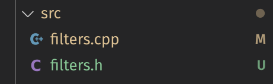
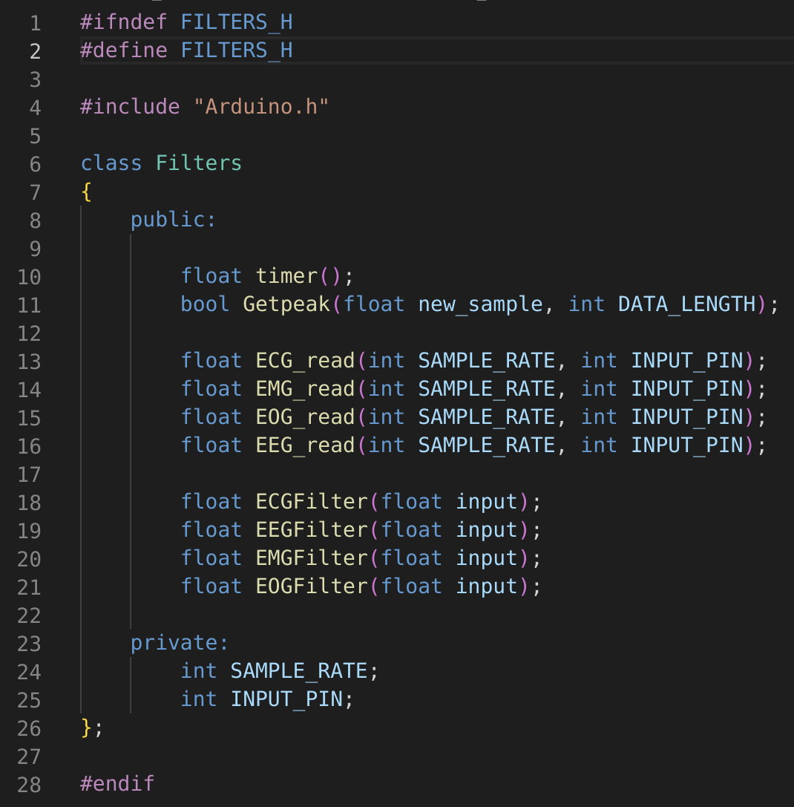
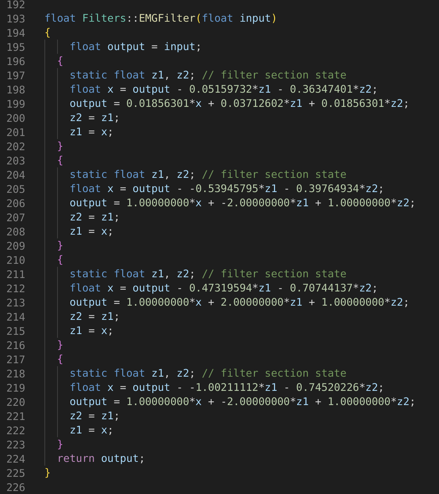
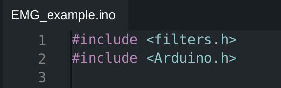
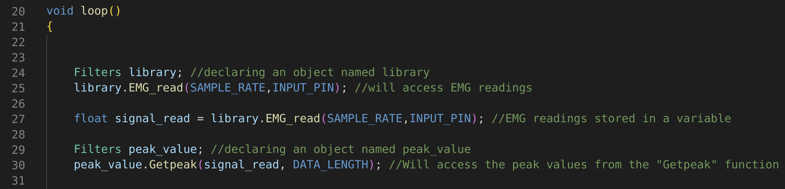

# Multi Channel Library

A multi channel supported library for Bio Potential Filters which means that we can access multiple ADCs at the same time using this library. This library provides a collection of filtering algorithms such as EMG, EOG, ECG, EEG Filters, enabling developers to easily analyze and manipulate these signals.

## Features

| **Features** | **Description** |
| :-----: | :---------:
|[Multi-Channel Supported](#multi-channel) | Multiple ADCs can be setup simultaneously for efficient processing |
|[Variable Sampling Rate](#variable-sampling-rate) | Different sampling rates can be used for different ADCs |
|[Variable Filtering Algorithms](#variable-filtering-algorithms) | EMG, EOG, ECG, EEG Filters can be used with this library |
|[Easy Access to the readings](#easy-access) | Readings can be accessed easily with the help of library | 
|[Better Form Factor](#better-form-factor) | Provides easy integration of codes as we don't have to write the long functions repeatedly for different filters |

## Library Guide

To Understand the working of Multi-Channel Supported Library, have a look at the following points:

1. The Library consists of the source codes i.e. "filters.cpp" & "filters.h":

    

2. In the "filters.h" file, we have declared a Class which has few member functions (Filtering algorithm functions)

    

3. In the "filters.cpp" file, we have used the class member functions along with its definition:
	For Example: This function has definitions for EMG Filter.
	
    

## Application

To get started with this Library, follow these steps:

1. Import the library into your project:

    
    
	
2. In the main loop create an object and load the acquired filter readings into that object, create another object and access the peak value from the "Getpeak()" function:

3. Further, it can be easily used in the project by calling it wherever required.